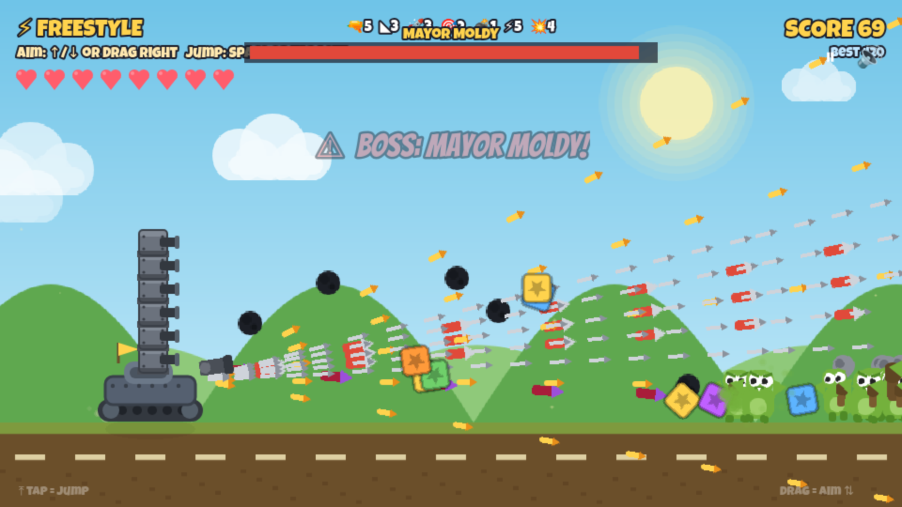

# Rampage 🚗💥



A kid-friendly side-scrolling car combat & upgrade game. Drive a junky
cardboard car across five wild lands, smash silly monsters, collect supplies,
and upgrade your way to a rocket-firing battle tank.

See **[GAME_DESIGN.md](./GAME_DESIGN.md)** for the full design plan (cars,
weapons, enemies, all five levels, and the build roadmap).

## Run it

Requires [Node.js](https://nodejs.org/) 18+.

```bash
npm install     # one-time
npm run dev      # start the dev server, then open the printed URL
```

Build a shareable static version:

```bash
npm run build    # outputs to dist/
npm run preview  # serve the production build locally
```

## Play online (GitHub Pages)

The game is a built site — you can't point GitHub Pages at the raw source
(`index.html` imports Phaser as a module the browser can't resolve, so you'd
get a blank screen). The included workflow handles the build for you:

1. In the repo, go to **Settings → Pages**.
2. Under **Build and deployment → Source**, choose **GitHub Actions**.
3. Push to `main` (or this branch) — the
   [`Deploy to GitHub Pages`](.github/workflows/deploy.yml) workflow builds the
   game and publishes it. Watch progress in the **Actions** tab.
4. When it finishes, your game is live at
   `https://<your-username>.github.io/<repo-name>/`.

Re-running happens automatically on every push.

## Controls

The car drives itself and **auto-fires**. You aim and jump.

| Action | Keyboard | Touch |
|--------|----------|-------|
| Aim up / down | ↑ / ↓ | Drag on the right half |
| Jump | Space or W | Tap the left half |

Aim up to shoot flyers, leap short goblins, and shoot lobbers' rocks out of the
air (or just jump them). Jump-over ground hazards are currently disabled.

**Mega enemies & turrets:** every now and then a big, tough **mega enemy** rolls
in with its own health bar. Defeat one and it bolts an extra **gun turret** onto
the roof of your car (up to three) — each fires straight ahead for extra
firepower, and they stick with you for the rest of the run.

**End-of-level horde:** when you reach the end of a level, a **horde** of enemies
swarms in all at once before the boss. Clear them for **bonus scrap** — with an
extra reward for a perfect clear (defeating every last one).

## Status

**Milestone 0 — Skeleton (done):** auto-scrolling parallax world, a cardboard
car you steer up/down, and a working fire button.

**Milestone 1 — Core loop (done):** goblins run in from the right, your shots
destroy them with a cartoony poof, defeated goblins drop Scrap that auto-homes
into a counter, a progress bar tracks your run, and a checkered finish flag
rolls in to end the level.

**Milestone 2 — The Garage (done):** finishing a level rolls you into Bolt the
robot dog's Garage. Spend Scrap on a new **car body** (Cardboard Cart → Wooden
Wagon → Iron Buggy) or **weapon** (Bow → Crossbow → Catapult) — the car preview
and your real in-game stats (fire rate, projectile, damage) change with each
pick. Affordable items glow, owned ones can be re-equipped for free, and
everything saves to `localStorage`, so progress survives a refresh. Hit
**ROLL OUT!** to start the next level with your upgraded ride. Art is still all
generated in code — no binary assets yet.

**Milestone 3 — Variety & combat (done):** the car now drives on the ground and
**jumps** (no more floating), and ↑/↓ **aim the weapon** instead of moving the
car. Four enemy types — **Runner**, **Brute** (big, tanky), **Lobber** (throws
arcing rocks you can shoot down or jump), and **Flyer** (winged, aim up to hit)
— plus a spiky **ground hazard** to jump. A **hearts** health system with
invulnerability blink, and a **Game Over → retry** screen (you keep your scrap).

**Milestone 4 — Boss & audio (done):** Level 1 now has a climax. At the end of
the run the **Goblin Drummer** mini-boss rolls in (summoning goblins), and
beating it brings out **Big Chief Gloop** — a wheelbarrow chief with a health
bar who hurls arcing cabbages (jump them or shoot them down) and goes enraged
below half health. Beating Gloop drops the **Sturdy Axle**, which unlocks the
Wooden Wagon in the Garage. Plus the first **audio**: a synthesized chiptune
loop and sound effects (shoot, jump, pickup, hits, explosions, win/lose
jingles) — all generated in code, no audio files — with a 🔊 **mute toggle**.

**Milestone 5 — The full adventure (done):** all **five levels** are in, each a
distinct biome (data-driven from `src/data/levels.js`) with recoloured enemies,
its own hazard, a mini-boss, and a boss:

| Level | Biome | Boss | Unlocks |
|-------|-------|------|---------|
| 1 | Goblin Greenwood 🌳 | Big Chief Gloop | Wooden Wagon |
| 2 | Zombie Flats 🧟 | Mayor Moldy | Iron Buggy |
| 3 | Bandit Badlands 🏜️ | Sheriff Snaketail | Armored Truck |
| 4 | Frostbite Peaks ❄️ | Frost King Yeti | Battle Tank |
| 5 | Volcano Fortress 🌋 | King Krang | 🏆 Champion! |

The upgrade tree is complete: **5 car bodies** (Cardboard Cart → Wooden Wagon →
Iron Buggy → Armored Truck → Battle Tank, each gated behind a boss drop) and
**5 weapons** (Bow → Crossbow → Catapult → Cannon → Rocket). Beating the final
boss rolls the victory/Champion ending. It's a complete game — all art and
audio still generated in code, no binary assets.

**Next-level pass — crispness, juice, variety (done):**
- **Crisp rendering:** the smooth vector art is now antialiased (was running in
  jagged pixel-art mode) — sharper sprites, fonts, and backgrounds everywhere.
- **Game feel:** star-burst muzzle flashes, car squash-&-stretch on jump/land,
  explosion shock-rings, a screen-flash on boss kills, and floating reward
  numbers.
- **Signature enemies + per-biome rosters:** on top of runner/brute/lobber/flyer,
  each land now mixes in its own threats — **chargers** (wind up and dash),
  **shielded** foes (break the front plate first), **splitters** (burst into
  little runts), and **divers** (swoop from the air). Every biome pulls from its
  own spawn table, so levels finally play differently, not just recoloured.
- **Kill combos:** chain defeats to build a **x2–x5 multiplier** (more score in
  Freestyle, more loot in the campaign). A hit breaks the streak — so there's a
  reason to play cleanly.
- **Bosses that actually fight:** each boss now cycles **telegraphed attacks**
  (lob, fan spread, minion summon, and a rain-down barrage), **enrages at half
  health** (faster, nastier patterns), and glows during a wind-up — hit it in
  that window for a **double-damage crit**. Mini-bosses summon in waves.
- **Animation:** cars roll on **spinning spoked wheels**, ground enemies waddle
  with a hop-and-squash walk, and flyers flap their wings.
- **Upgrade identity:** bodies now trade **health for jump height** (light
  Cardboard springs highest; the Battle Tank is toughest but grounded), and
  weapons have real behaviours — the **Catapult** and **Rocket** deal **splash**
  damage (clear crowds), the **Cannon pierces** through a line of enemies. The
  Garage shows a stat chip (❤/jump, ⚔/behaviour) on every card plus a hover
  tooltip, so the trade-offs are clear (the Catapult is no longer a trap buy).
- **Living backgrounds:** a new hazy **distant-mountain** parallax layer and
  scrolling **biome props** (leafy trees, dead trees, cacti, snowy pines,
  volcanic rocks) give each land real depth, and ground enemies cast **contact
  shadows**.
- **Mid-level power-ups:** the campaign now has live vehicle power during the
  run, not just at the Garage. Twice per level a **📦 Supply Drop** parachutes
  in **three crates — you can only grab ONE** (drive into it, or jump to pass it
  up): ⚡ Rapid Fire, ◣ Triple Shot, 🛡 Shield, 🧲 Scrap Magnet, ❤ Heal. Enemies
  also rarely drop crates, and hitting **combo x3 / x5 earns a guaranteed prize
  crate** — so skilled streaks now pay off in firepower. Boosts are **temporary**
  (timers show as chips under your hearts; longer in Kid Mode), the Shield soaks
  a hit **without breaking your combo**, and the Garage economy stays intact.
- **Dynamic audio:** every biome has its **own music theme** (bright Greenwood,
  spooky Zombie Flats, western Badlands, airy Frost, driving Volcano, plus a
  party track for Freestyle), now with a **drum groove** that **ramps up for
  boss fights and again on your last heart**. Music and effects run on separate
  buses through a limiter; SFX are pitch-varied so they don't fatigue, with new
  cues for combos, weak-point crits, and boss entrances. A **⚙ Settings** panel
  (on the title and pause menus) gives independent **Music / SFX volume** and a
  sound toggle, all saved.

**Polish & shell (done):** a **title screen** (your current car idling on an
animated landscape) with **PLAY**, **⚡ Freestyle**, a **Kid Mode** toggle, and —
when applicable — **New Game** and **🔄 Reset Freestyle arsenal**; a **pause
menu** (⏸ button or Esc/P → Resume / Restart Level / Main Menu), per-biome
**ambient weather** (pollen,
swamp spores, blowing sand, falling snow, rising embers), a sun/moon and
drifting clouds, wheel dust, muzzle flashes, a damage flash, and smooth scene
fades.

**Freestyle bonus round (done):** an action sandbox for the power-up crowd,
launched from the title screen. Endless escalating waves; defeated enemies drop
weapon and boost pickups (**+gun, +spread, +rocket, +missile, +bomb, +fire
rate, +power, +heart**) that stack onto your tank, which grows into a rolling
gun-tower firing bolts, rockets, homing missiles, and lobbed bombs.

The arsenal is **capped so it never floods the screen**: each weapon fires up to
a fixed number of projectiles (guns 6, spread 5, rockets 4, missiles 3, bombs 2)
and fire-rate has a ceiling. Pickups collected past a cap don't add more
bullets — they **level up that weapon** (each shot hits harder and a little
bigger), shown as a **★N** badge in the HUD. As you grow more powerful, the
waves get denser and **rotating bosses** roll in on a score cadence, scaling in
toughness and dropping bigger loot. Your **arsenal is saved and persists across
replays** (Replay keeps it; Start Fresh, or **🔄 Reset Freestyle arsenal** on
the title screen, wipes it back to starter while keeping your best score). Score
and best are tracked.

**Real display fonts (done):** the title, HUD, buttons, and banners now use
chunky comic-book fonts (**Bangers** for headlines, **Luckiest Guy** for UI)
instead of the system font — a big step toward a finished, "real game" look.
The car also casts a contact shadow that shrinks as it jumps. This is the first
real third-party *asset* in the project (see Credits); the same approach
(loading files under the existing texture keys) is how sprite art gets added
next, per [docs/ART_UPGRADE.md](./docs/ART_UPGRADE.md).

**Kid Mode (done):** an invincible mode for young players, toggled on the title
screen. The car can still be bumped (it flashes and gets briefly stunned) but
never loses hearts and there's no Game Over — so little kids can just drive,
shoot, and enjoy the ride. A "👶 KID MODE" badge shows in the HUD when it's on.

**Real-art drop-in pipeline (done):** any PNG you add to
`public/assets/sprites/` and register in `src/data/assets.js` automatically
replaces the matching code-drawn placeholder — no gameplay changes. See
**[docs/ASSETS.md](./docs/ASSETS.md)** for the full list of art keys, sizes, and
where to get free/CC0 art that fits — or
**[docs/AI_PROMPTS.md](./docs/AI_PROMPTS.md)** for a ready-to-paste prompt pack
(and AI-tool recommendations) to generate the whole art family yourself.

See **[docs/ART_UPGRADE.md](./docs/ART_UPGRADE.md)** for the broader plan
(animation, shaders, etc.). Other possible next steps: a cosmetic sticker shop.

## Tech

- [Phaser 3](https://phaser.io/) — HTML5 2D game framework
- [Vite](https://vitejs.dev/) — dev server & bundler
- Plain JavaScript (ES modules)

## Credits

All sprites and sound are still generated in code. The only bundled assets are
the display fonts, used under their open licenses (license texts are in
`public/fonts/`):

- **Bangers** by Vernon Adams / Google Fonts — SIL Open Font License 1.1
- **Luckiest Guy** by Astigmatic / Google Fonts — Apache License 2.0
